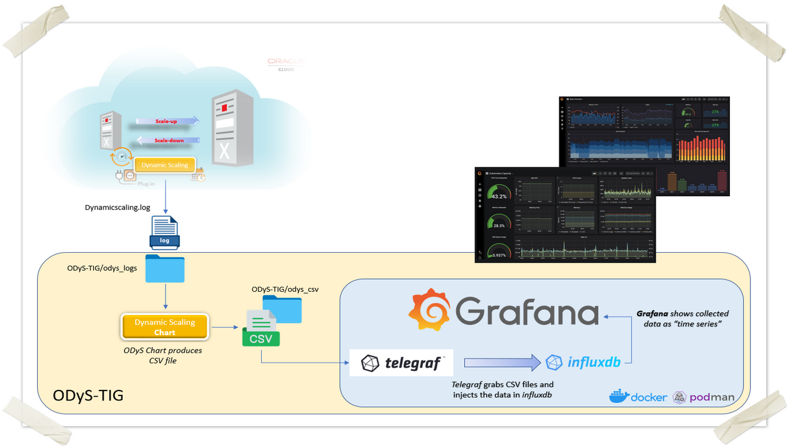
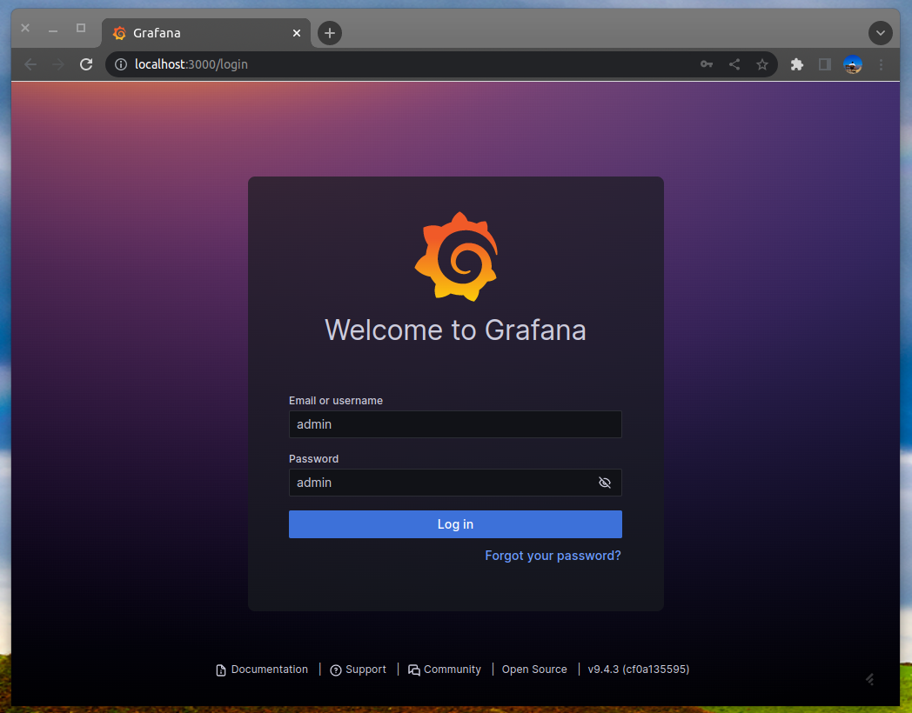

# 🚀📊 ODyS‑TIG: Dynamic Scaling Monitoring Stack (Telegraf • InfluxDB • Grafana) 

<div align="center">

**Version:** 2.1.0
**Author:** 👨‍💻 Ruggero Citton — RAC Pack, Cloud Innovation & Solution Engineering Team 
</div>

## 🌟 Overview

**ODyS‑TIG** provides an automated, container‑based monitoring stack for analyzing **[Oracle DynamicScaling (ODyS)](https://support.oracle.com/epmos/faces/DocumentDisplay?id=2719916.1)** behavior. With a single command (`make setup_monc` or `make setup_mop`), ODyS‑TIG:

* 🔍 Parses `dynamicscaling.log`
* 📄 Generates CSV metrics
* 🔄 Feeds them into **Telegraf → InfluxDB → Grafana**

The result is a ready‑to‑use **Grafana dashboard** showing **OCPU/ECPU**, **Node Load**, **Cluster Load**, and **Dynamicscaling Plugin Load** time‑series (showing by default last 7 days data).



<div align="center">

[](https://podman.io)
[](https://support.oracle.com/epmos/faces/DocumentDisplay?id=2762561.1)
[](https://docs.influxdata.com/telegraf/v1/)
[](https://docs.influxdata.com/influxdb/v2//)
[](https://btrfs.wiki.kernel.org)
</div>

If you need deeper insights than the standard **DynamicScaling Chart** tool ([(ODyS) Oracle Dynamic Scaling - Charts maker for Dynamic Scaling engine utility - Doc ID 2762561.1](https://support.oracle.com/epmos/faces/DocumentDisplay?id=2762561.1)), ODyS‑TIG provides:

* 📊 Automated CSV extraction (OCPU/ECPU, Node, Cluster, ODyS remote-plugin load)
* 🔌 Automatic ingestion via Telegraf
* 🧩 Default Grafana dashboards
* 💻 Multi‑platform architecture support (x86_64, ARM64)

---

## Supported Architectures & Operating Systems

ODyS‑TIG 2.1.0 supports **x86_64** and **ARM64 (aarch64)** across Linux and macOS.

**Validated platforms:**

* 🔵 Oracle Linux 9 — x86_64
* 🔵 Oracle Linux 8 — x86_64 & aarch64
* 🟣 Ubuntu 24.03 — x86_64
* 🍏 macOS Tahoe 26.2, Sequoia 15.7.3
* 🪟 Windows 11 — x86_64 (via podman machine)

> **macOS requirement:** for podman allocate at least **2 CPUs** and **8 GB RAM** and setup a volume:
```
podman machine init --cpus 2 --memory 8192 --disk-size 50 --volume /Users/<username>/GIT/ODyS-TIG:/ODyS-TIG
```
    Note: 
    '/Users/<username>/GIT/ODyS-TIG' must be the same path defined by 'MACOS_HOST_PROJECT_PATH' in 'config.env'
    '/ODyS-TIG' (on Tahoe), '/Users/core/ODyS-TIG' (on Sequoia) must be the same path defined by 'VM_MOUNT_ROOT' in 'config.env'

---

## 📦 Prerequisites 

### 1. 🦭 Podman & podman-compose

Install Podman:

```
dnf install podman
```

Install podman‑compose (version **1.0.6+**):

```
sudo dnf install -y oracle-epel-release-elX
sudo dnf config-manager --enable olX_developer_EPEL
sudo dnf install -y podman-compose 
podman-compose version

#(X=8|9)
```
Note: podman-compose needs **python 3.8+**

Optional firewall configuration:

```
firewall-cmd --zone=public --add-masquerade --permanent
firewall-cmd --zone=public --add-port=443/tcp
firewall-cmd --reload
```

### 2. 📦 DynamicScaling‑Chart RPM 

Download the RPM for your CPU architecture (x86_64 or aarch64) and place it under:

```
ODyS-TIG/odys_chart/
```

(See MyOracle Support: [(ODyS) Oracle Dynamic Scaling - Charts maker for Dynamic Scaling engine utility - Doc ID 2762561.1](https://support.oracle.com/epmos/faces/DocumentDisplay?id=2762561.1))

---

## 🚀 Getting Started
For simplicity, on Linux you should disable SELinux (`setenforce 0`)

1. 📥 Clone repository: `git clone https://github.com/oracle/ODYS-TIG.git`
2. 📂 Enter folder: `cd ODyS-TIG`
3. 📝 Edit `config.env` for OS type (Linux or MacOS) Podman paths and authentication
4. 📦 Copy DynamicScaling‑chart RPM to `odys_chart/`
5. 📁 Place your `dynamicscaling.log` into `odys_logs/`
6. ▶️ Run one of:

   * `make setup_monc` — OCPU/ECPU + Node/Cluster Load
   * `make setup_mop` — OCPU/ECPU + Plugin Load

Access Grafana at **[http://localhost:3000](http://localhost:3000)**
(default login: `admin/admin`) 🔐



Dashboards:

* 📊 **ODyS‑TIG‑MONC** — Node/Cluster load
* 🔧 **ODyS‑TIG‑MOP** — Plugin load


Enjoy the charts (!)


---

## 🧰 Commands Reference 

### 📜 List of available commands
* `make`

### 🦭 Container Operations

* `make setup_monc` — setup + MONC extraction
* `make setup_mop` — setup + MOP extraction
* `make setup` — start Telegraf, InfluxDB, Grafana
* `make start` / `make stop` — control containers
* `make status` — show status
* `make cleanup` — remove containers
* `make cleanupall` — remove containers + images
* `make reset_monc` / `make reset_mop` — cleanup + reload data

### 📈 CSV / Chart Generation 

* `make monc` — OCPU/ECPU, Node Load, Cluster Load
* `make mop` — OCPU/ECPU + Plugin Load
* `make ocpu` — only OCPU/ECPU
* `make nload` — Node Load
* `make cload` — Cluster Load
* `make pload` — Plugin Load
* `make TYPE=<type> LOG=<file> LABEL=<label> mextract` — custom multi‑env extraction

Example:

```
make TYPE=cocpu LOG=exadb01_dynamicscaling.log LABEL=exadb01 mextract
```

Creates:

```
odys_csv_new/dynamicscaling-chart_ocpu-exadb01.csv
```

### 🖥️ Container Shell Access 

* `make ct` — Telegraf
* `make ci` — InfluxDB
* `make cg` — Grafana

---

## ⚙️ Configuration Details 

`config.env` example:

```
# -----------------------------------------------------------------
# Environment variables for ODyS-TIG deployment based on OS
# -----------------------------------------------------------------
# Set to 'Linux' or 'MacOS'
OS_TYPE=Linux

# Absolute path on macOS from which the make command is run
MACOS_HOST_PROJECT_PATH=/Users/<username>/GIT/ODyS-TIG

# -----------------------------------------------------------------
# Environment variables for Podman/Podman-compose
# -----------------------------------------------------------------
# Set Container Engine : "<path>/podman"
CONTAINER_ENGINE=/usr/bin/podman

# Set Container Compose : "<path>/podman-compose"
CONTAINER_COMPOSE=/usr/bin/podman-compose

# Set Proxy env variable (ie: http://myproxy.mycompany.com:80)
PROXY=

# -----------------------------------------------------------------
# Environment variables for ODyS-TIG deployment
# Note: INFLUXDB_INIT_PASSWORD Must be >= 8 chars
# -----------------------------------------------------------------
# Telegraf time zone
TIMEZONE=Europe/Rome

# InfluxDB Configuration (InfluxDB 2.x)
INFLUXDB_INIT_USERNAME=admin
INFLUXDB_INIT_PASSWORD=adminadmin123
INFLUXDB_INIT_ADMIN_TOKEN=my-super-secret-auth-token
INFLUXDB_INIT_ORG=myorg

# Grafana Configuration
GF_SECURITY_ADMIN_USER=admin
GF_SECURITY_ADMIN_PASSWORD=admin

# UID/GID for Telegraf (used for volume permissions)
# UID=1000
# GID=1000
# -----------------------------------------------------------------
# EndOfFile
# -----------------------------------------------------------------
```

---

## 📊 InfluxDB & Grafana Integration 

ODyS‑TIG creates:

* 📁 InfluxDB bucket: `dynamicscaling`
* 🔎 Measurement: `directory_monitor`

Time‑Series created:

* `dynamicscaling-chart_ocpu.csv`
* `dynamicscaling-chart_nload.csv`
* `dynamicscaling-chart_cload.csv`

Flux Query example:

```
from(bucket: "dynamicscaling")
  |> range(start: v.timeRangeStart, stop: v.timeRangeStop)
  |> filter(fn: (r) => r._measurement == "directory_monitor" and
                       r.filename == "dynamicscaling-chart_<label>.csv")
  |> filter(fn: (r) => r._field == "Current OCPU/ECPU" or
                       r._field == "Node Load" or
                       r._field == "Cluster Load" or
                       r._field == "Plugin Load")
  |> aggregateWindow(every: v.windowPeriod, fn: mean, createEmpty: false)
```

---

## 🧪 Usage Examples 

### 1. 🟦 Node/Cluster Load System 
Having Dynamicscaling running w/o remote-plugin, OCPU/ECPU and Node load are collected. If "--acfs" dynamicscaling option is in use, also "Cluster Load" is defined in the dynamicscaling.log file. In this case we can setup ODyS-TIG within one click issuing:
```
make setup_monc
```

Having an up to date dynamicscaling.log (from the same system), we can add/update the data on ODyS-TIG, issuing:
```
make monc
```

In the case we need to evaluate the dynamicscaling.log from a new environment, we can reset ODyS-TIG within one click issuing:
```
make reset_monc
```

### 2. 🔌 Plugin Load System 

Having Dynamicscaling running with remote-plugin, Plugin Load is collected and Node/Cluster load are not collected. In this case we can setup ODyS-TIG within one click issuing:
```
make setup_mop
```

Having an up to date dynamicscaling.log (from the same system), we can add/update the data on ODyS-TIG, issuing:
```
make mop
```

In the case we need to evaluate the dynamicscaling.log from a new environment, we can reset ODyS-TIG within one click issuing:
```
make reset_mop
```

### 3. ⏯️ Start / Stop

Its possible stop/start ODyS-TIG environment issuing:

```
make stop
make start
```

### 4. 🌐 Multi‑environment Dashboards
Make a new Grafana Dashboard/Graph for a specific environment or for multiple dynamicscaling log files

a. Setup ODyS-TIG issuing
```
make setup
```

b. Collect data (we are interested on OCPU/ECPU, "Node load" and "Cluster Load") for such specific environment (for example 'Node01'/'Node02', for which dynamicscaling.log is called 'Node01_dynamicscaling.log'/'Node02_dynamicscaling.log' ), issuing:

Example:

```
make TYPE=cocpu LOG=Node01_dynamicscaling.log LABEL=Node01 mextract
make TYPE=nload LOG=Node01_dynamicscaling.log LABEL=Node01 mextract
make TYPE=cload LOG=Node01_dynamicscaling.log LABEL=Node01 mextract
#
make TYPE=cocpu LOG=Node02_dynamicscaling.log LABEL=Node02 mextract
make TYPE=nload LOG=Node02_dynamicscaling.log LABEL=Node02 mextract
make TYPE=cload LOG=Node02_dynamicscaling.log LABEL=Node02 mextract
```

Files "./odys_csv_new/dynamicscaling-chart_ocpu_NodeX.csv" and "./odys_csv_new/dynamicscaling-chart_nload_NodeX.csv" (where X is 0|1) are generated

The data loaded into Influxdb® will be recognized by 'filename=dynamicscaling-chart_ocpu_NodeX.csv' and 'filename=dynamicscaling-chart_nload_NodeX.csv' (where X is 0|1) as new SERIES.

New Grafana Dashboard(s) are now available as:
- ODyS-TIG - MONC - Node01
- ODyS-TIG - MONC - Node02

c. Cleanup all ODyS-TIG component, issue:
```
make cleanupall
```

---

## 🧭 Summary 

**ODyS‑TIG** enables fast, repeatable, and visual analysis of **Oracle DynamicScaling** behavior. By automating CSV extraction, metrics ingestion, and dashboard provisioning, it greatly reduces operational overhead.

---
<div align="center">

**⭐ Star this project if you find it useful!**

</div>
